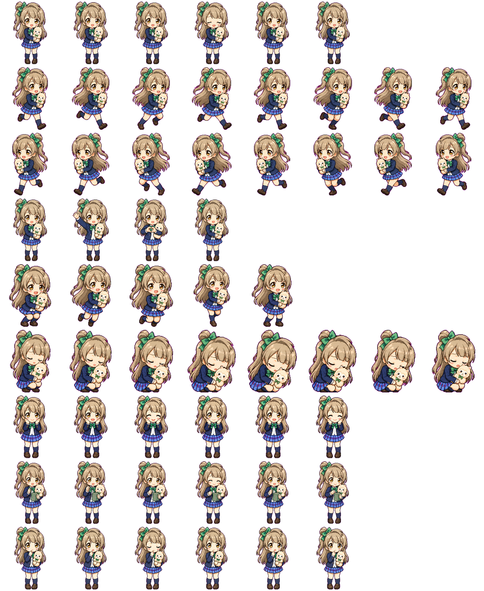

# 🐦 Kotori Pet

一只住在桌面上的像素风南琴梨（Kotori Minami）。她跟随 Claude Code / Codex 的生命周期事件切换动画与气泡台词。

基于 [Tauri v2](https://v2.tauri.app/)（Rust + HTML/CSS/JS）构建。

<p align="center">
  
</p>

> ↑ 完整精灵图：9 个状态行 × 8 列网格，共 55 帧动画。规格详见 [desktop/docs/spritesheet.md](desktop/docs/spritesheet.md)。

## 快速开始

```bash
cd desktop/cross-platform
cp config.example.json config.json   # 按需修改
./setup.sh                           # 一键：依赖 → 配置 → hooks → 编译 → 启动
```

## 交互

| 操作 | 效果 |
|---|---|
| 单击 | 跳跃 🎉 |
| 三连击（3s 内） | 清空所有会话 🧹 |
| 拖动 | 移动位置（方向奔跑动画） |
| 右键 | 菜单：Codex / VS Code / 关闭 |

## 架构

```
Claude Code / Codex → hook 脚本 → session 文件 + Unix Socket → Tauri 渲染器
                                                                ├── Rust: 多会话聚合 + 双通道监听
                                                                └── JS: 精灵动画 + 对话气泡
```

状态优先级：`waiting > running > running-left/right > review > jumping > waving > idle > failed`

## 在 Codex 中生成宠物素材

通过 Codex Skill 一键生成像素资料包，详见 [教程](docs/codex实现虚拟宠物.md)。

## 文档

完整索引（架构 / Hook 协议 / 源码 / 配置 / 精灵图规格 / Bugfix）详见
[docs/reference/details.md](docs/reference/details.md)。

## 目录结构

```text
.
├── assets/kotori-minami/   # 资料包（frames/ 运行时 + imagegen/ 生成工件）
├── desktop/
│   ├── cross-platform/     # Tauri 主实现（src/ + src-tauri/ + hooks/）
│   └── docs/               # 跨平台 / Hook / 精灵图 / Bugfix
└── docs/                   # 顶层文档（教程 + reference/details.md）
```

## 要求

- macOS 13+ · [Rust](https://rustup.rs/) + Cargo · Node.js + npm · Python 3

## License

MIT
